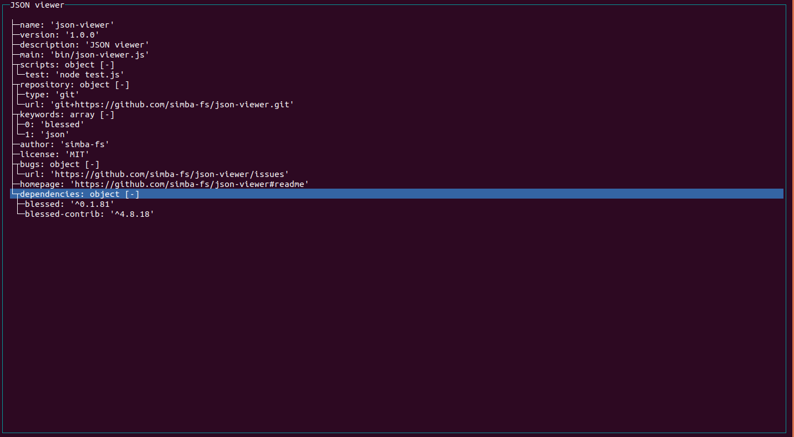

# json-viewer
<center>

</center>
# Introduction
This is a json viewer written in node.
Graphicalization with blessed.

# usage
```
./bin/json-viewer.js <filename>
```

# Contributor
[](https://github.com/simba-fs)

# Licence
[MIT](./LICENSE)
